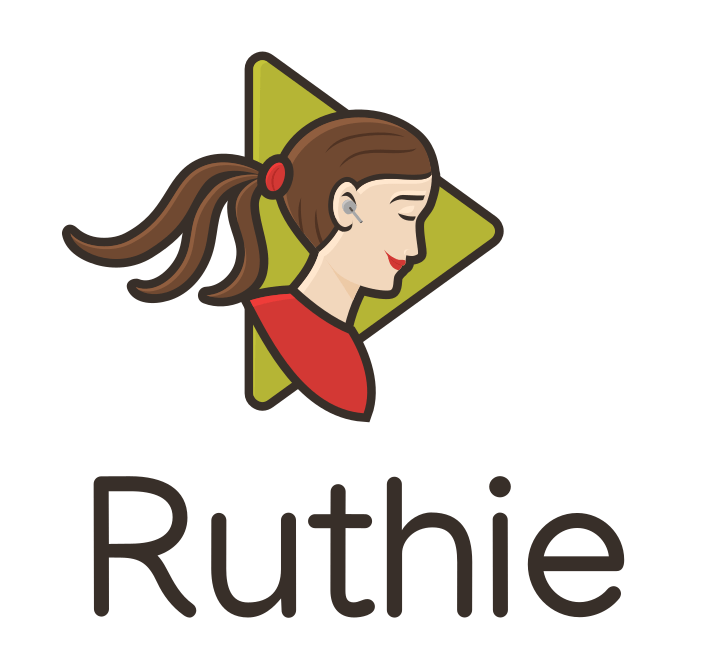

# Ruthie

[](releases)
[](LICENSE.md)

<div align="center">
	
</div>


Ruthie is the Unittests runner, and it's an acronym from "Run Unit Tests Harmoniously Incredibly Easy".

## Installation

```sh
pip install -U ruthie
```

Check if it works:

```sh
ruthie --version
> 0.1.2
```

## Usage

Type `ruthie --help` to display available commands and options

### Examples

#### List all test classes in directory "unittests"

```sh
ruthie discover classes unittests
```

Output:

```sh
unittests.admin_panel.users.Add
unittests.admin_panel.users.Edit
unittests.admin_panel.users.Delete
unittests.admin_panel.devices.Add
unittests.admin_panel.devices.Edit
unittests.admin_panel.devices.Delete
unittests.end_user.projects.Add
unittests.end_user.projects.Edit
unittests.end_user.projects.Delete
```

#### List all test classes in directory "unittests" and group them

```sh
ruthie discover classes unittests --group
```

Output:

```sh
  unittests.admin_panel.users
    Add
    Edit
    Delete
  unittests.admin_panel.devices
    Add
    Edit
    Delete
  unittests.end_user.projects
    Add
    Edit
    Delete
```

#### Discover all classes in directory "unittests" and run them in parallel using 10 threads

```sh
ruthie parallel --threads=10 unittests
```

## License

This project is licensed under the ISC License - see the [LICENSE](LICENSE) file for details.
